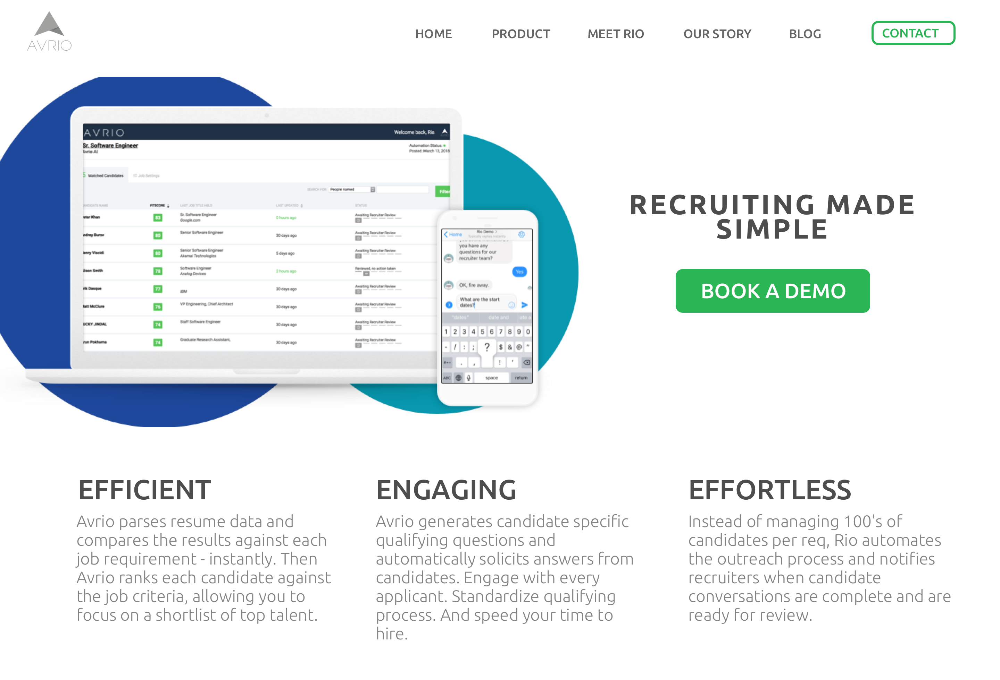
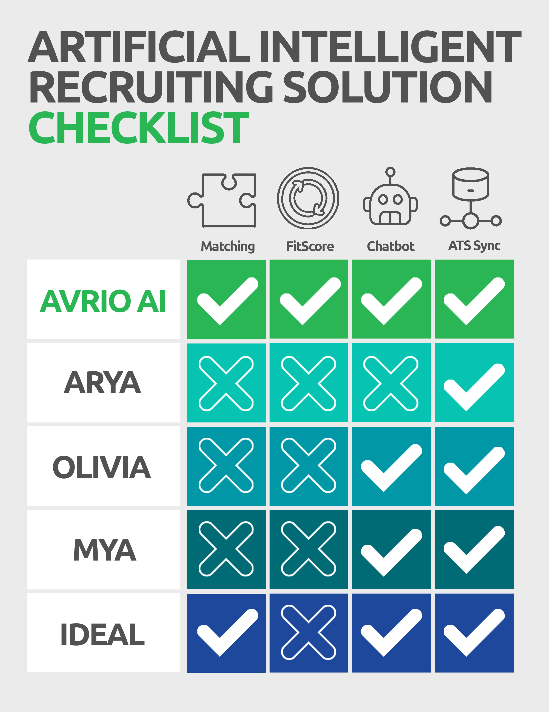
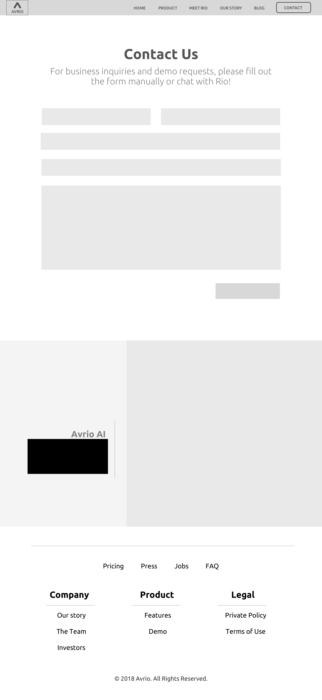

<h2 class="h2">Project Overview</h2>

I interned at Avrio AI, an AI human resources startup, as a front-end engineer and UI designer. I worked closely with the Marketing Lead to develop a corporate visual identity and to expand this to their marketing website hosted on the HubSpot CMS. I added an integration with an AI chatbot which increased leads 36% by while decreasing the bounce rate to 22%.

##Define

###The Company
<h3 class="doubleHeader">The Prompt</h3>

Avrio's product utilizes artificial intelligence to screen applicants by analyzing their resumes against the job description and perfoming an initial screening with an AI chat bot. Before designing their company website, I performed market research into Avrio's competitors, analyzing the content, design, and user experience of those sites. We wanted the new look of Avrio to fall within the same realm, yet stand out amongst their competitors. .

###The Issues

Key components of the redesign included shifting the narrative of the company toward a modern, AI tech company, explaining the product, and increasing leads to sales. The website was outdated and did not reflect the pivot that Avrio was making. Given the concerns that the product was changing the role of a recruiter, we wanted to design an interface that was welcoming and trusting. We focued on the verbiage of the to ensure that recruiters saw Avrio as a tool, rather than a .. to their careers. 

##Ideate
<h3 class="doubleHeader">Wireframes</h3>

I developed wireframes and presented to uppermanagemenet.

###Mockup

##Build
###CMS

Avrio was hosted on HubSpot, . 

###AI Chat Bot

Avrio's primary marketing came in the form of inbound marketing campaigns, where. I designed 

##Inbound Marketing
<h3 class="doubleHeader">Ad Strategy</h3>

Avrio's primary marketing came in the form of inbound marketing campaigns, where. I designed 

<h2 class="afterImg">Lessons Learned</h2>
<h3 class="doubleHeader">Get Thrifty</h3>

While there were beautiful, my manager expressed that she would prefer not to spend money on a theme. She also wanted to stay within the HubSpot ecosystem to continue tracking analytics on Avrio's website traction and inbound marketing campaigns. While I was unfamiliar with the HubSpot platform, especially with designing a theme for hubspot, I quickly found an online course to guide me through the process. While the platform was unintuive and difficult to develop upon, I delivered the final product in time for a large technology conference.

###Be Flexible

Working in a start-up, I had to leverage all of my skills and experience. While I was responsible for delivering the company website, I also assisted in product design, marketing campaigns, event planning, photography and videography.

