

<h2 class="h2 afterImg">Project Overview</h2>

While interning at Cogo Labs, a startup incubator, I was the design lead and React engineer alongside two engineers and two analysts. We were tasked to build and grow an internet business based on the general theme of "events" and to maximize 10 Key Performance Indicators (KPIs) regarding user interaction and revenue. Utilizing an Agile (Kanban) development approach, Hey Bartender grew from an idea to a live application with over 12,000 active users across the United States–all in 10 weeks.

###Key Performance Indicators
<ul>
    <li>Total Visits</li>
    <li>Total Organic Visits</li>
    <li>Total Time on Site</li>
    <li>Bounce Rate</li>
    <li>Page Views per Visit</li>
    <li>Returning Visitors</li>
    <li>Peak Arrivals in a Day</li>
    <li>Lowest Cost Per Click on an Ad (CPC)</li>
    <li>Profit Margin</li>
    <li>VPA (Revenue/Visits)</li>
</ul>

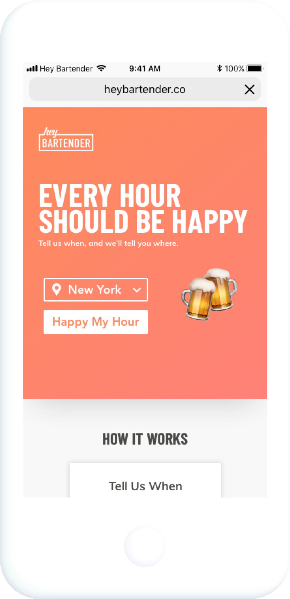

<h2 class="afterImg">Define</h2>
<h3 class="doubleHeader">The Prompt</h3>

Within the category of "events", we hypothesized potential high-growth sectors and tested them against the data by querying Cogo's internal databases. We discovered a large market within the category of Food and Drinks during our preliminary research. Wanting to narrow our efforts into a more niche, yet sizable, market, we drilled down the data to find two leads: happy hours and New York City.

###The Problem

What solidified our decision to enter this market was our competitors. I found the websites of our competitors, both direct and indirect, to be difficult to navigate and poorly designed. When I conducted preliminary user interviews, multiple pain points were repeatedly vocalized regarding the user experience of our competitors' products. One aspect, in particular, was the overwhelming choice paralysis users faced. After a tedious form, users are presented an endless list of restaurants and bars without any accompanying details about the specials, the price range, nor any images. They would then rely on Yelp or Google Reviews for the next step in the decision process. Overall, users were not given enough information from a single source to decide on where to go for happy hour. We knew that we could provide users a more personalized, efficient, and enjoyable way to find happy hours near them.

###The Users

While we had defined a problem we could address within a profitable market, we were unable to clearly define our target demographic through Cogo's databases. After researching into how bars and restaurants market their happy hours and to what demographic, I developed initial personas based on my assumptions to guide our process. I then iterated on these personas after running a series of Facebook advertising campaigns, collecting analytics on what demographics responded well to our targeted ads. The data sourced from Facebook allowed me to clearly define our target users and to develop guiding personas like Cara and Jonathan.

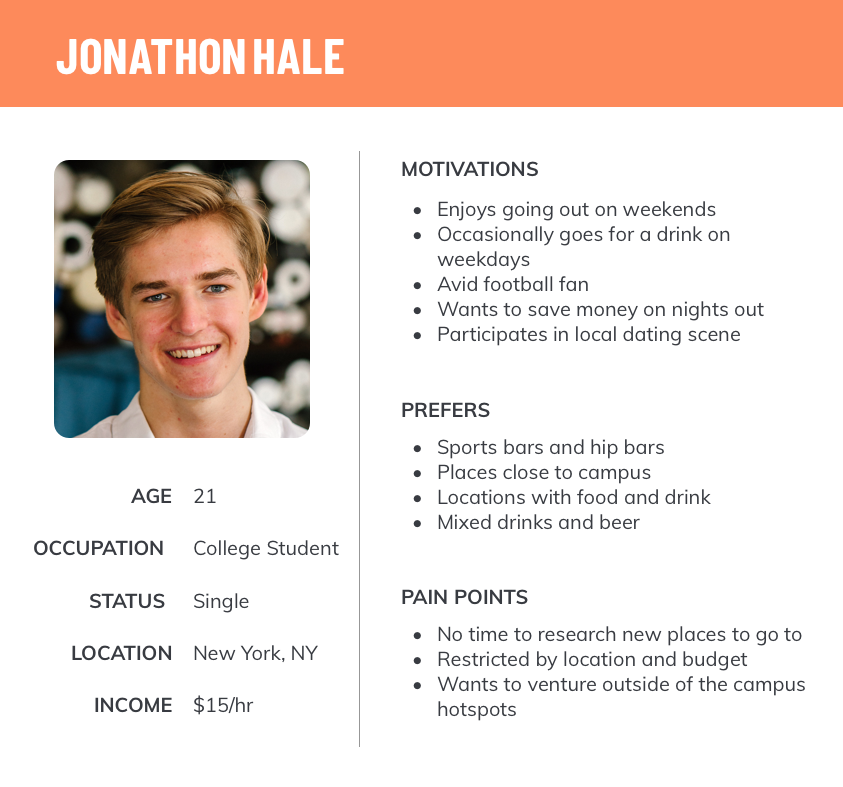 
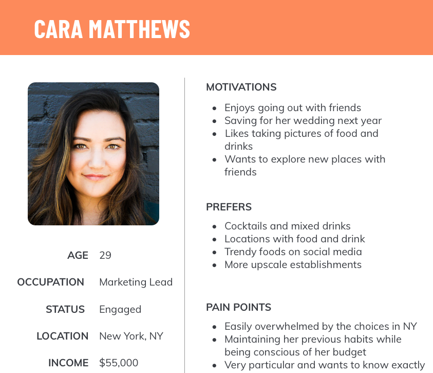

###Success

While we were given 10 KPIs, we prioritized certain metrics to reflect our definition of success for Hey Bartender. Based on the user's ideal experience with our website, we wanted to focus on the following KPIs:

<ul>
    <li>Total Visits</li>
    <li>Bounce Rate</li>
    <li>Page Views per Visit</li>
    <li>Returning Visitors</li>
    <li>Peak Arrivals in a Day</li>
    <li>Lowest Cost Per Click on an Ad (CPC)</li>
</ul>

By prioritizing these metrics, we were able to strategize our design, development, and marketing processes.

##Ideate
<h3 class="doubleHeader">Wireframes</h3>

Having established our technology stack, I wireframed our web application, starting with our Most Viable Product (MVP). We wanted an interactive experience that wouldn't require a complicated onboarding process, so I emulated Tinder's user experience. I wanted to show one option at a time to help users avoid choice paralysis. While the engineers agreed that my first draft of the MVP would be ready before our release deadline, I continued to simplify the MVP down to its core functionality. While some teammates disagreed with my oversimplification of the product, I wanted to ensure that our MVP was simple enough to use and developed well. I wanted to take into consideration future blockers and to prevent the need to resort to quick fixes just to meet our deadline. Our final MVP included a random happy hour generator for the city of New York without features such as a date selector, a button to return to the previous happy hour special, nor details about the restaurant or bar.

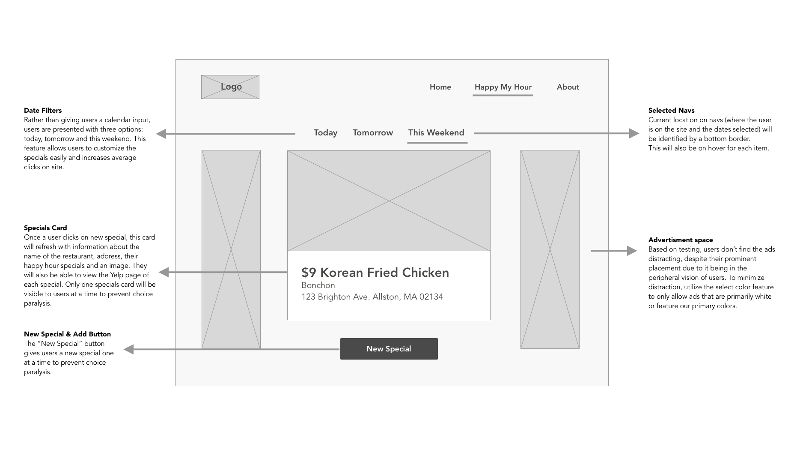

###Mockup and Style Guide

During the MVP hand-off process, the engineers and I had difficulty agreeing on a naming convention when referring to the front-end. To solve this issue, I led a meeting with my team to establish a common vocabulary in naming UI components on our site. By establishing a set of labels, we were able to work more efficiently and could all partake in conversations regarding our product. I also established scalable design patterns and code practices which allowed us to quickly grow our product beyond the MVP stage.

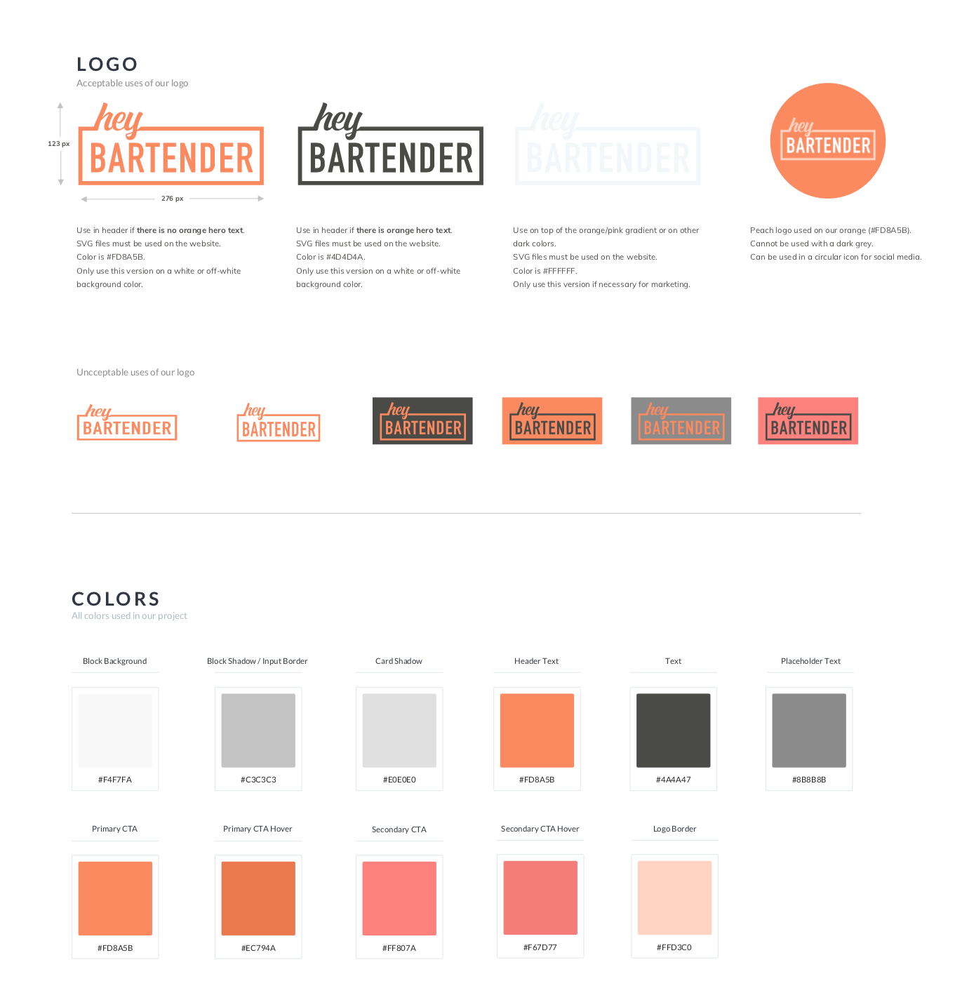

<a class="link" href="./styleguide.pdf" target="_blank" rel="noopener noreferrer">View full style guide</a>

I developed a style and branding guide to assist the engineers with the development of our site. Before the launch of our MVP, and subsequent update releases, I would conduct a front-end style pass through the website to ensure consistency across all devices. I noticed inconsistencies in color, alignment, and aspect ratios of images. I then documented these issues in the style guide with easy-to-copy CSS snippets.

##Iterate
<h3 class="doubleHeader">Ad Strategy</h3>

After our MVP went live, we launched a series of Facebook advertisements to drive traffic to our website and to gather feedback on user interaction. We were instructed to use Facebook and Instagram ads as our only source of paid traffic, with a budget of $7500 for 10 weeks. Working with the analysts, we designed various visual advertisements and A/B tests to improve our link conversions and the CPC (cost per click) of our ads. After experimenting with A/B tests, we found that the best ads designs featured images of women, had minimal text, and ran on Facebook only, rather than both Instagram and Facebook. Based on Facebook's algorithm, advertisements work best with high relevance scores and long-running lifetimes. If we were to redo this project, we would focus on a few ads and run them for the duration of the 10 weeks.

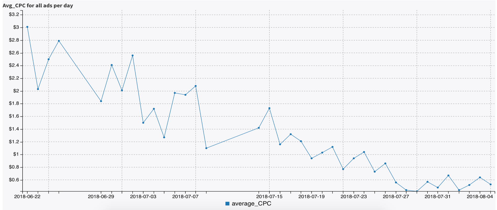 

###User Testing

Before our next iteration, I conducted user testing with a sample of 7 users both in and out of our target demographic. Since our data reflected that most of our users were accessing Hey Bartender on a mobile device, I utilized both Android and iOS devices for testing. I compiled my findings in a user testing report which included bugs, issues with usability, content, visual mishaps, and interesting findings. My most notable takeaways included confusion around our Yelp integration, the copy content on the homepage, and a user flow that needed more clarity, all of which we tackled in our next iteration.

###Expansion

While discussing the next big step for Hey Bartender, our team was split on which cities to expand to. The data pointed us in different directions and we wasted almost a day trying to plan our steady expansion, similar to how the other team was approaching expansion. The more we went back and forth, the more I wanted to take a risk: to expand to all cities in the U.S. at once (where we have happy hour data for). After sharing my cost-benefit analysis and given the strong base we established with building the MVP, I felt confident that we as a team could easily grow to over 120 cities. With the support of my team and after consulting upper management, we began to expand.
 

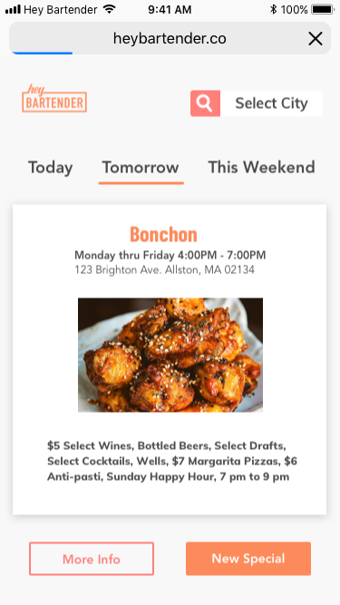

###Iterate and Improve

While the engineers focused on building out the back-end to scale to new cities, I began iterating on the front-end based on the insights from user testing. This included optimizing advertisement space and enhancing the mobile experience. Simply by fixing the unnecessary scrolling for mobile users, we were able to decrease our bounce rate from 70% to 55%. As a team, we wanted to integrate Google Ads to boost our revenue. However, I was concerned with how it would impact the user experience of Hey Bartender. I wanted to ensure users that Hey Bartender is a website they could trust and feel safe using, not a questionable site overwhelmed with distracting ads and popups. While raising revenue was important, it wasn't the sole objective of our product. We wanted to solve a problem for our users, not create more. After researching user interaction and how users respond to UI elements in their peripheral vision, I redesigned the layout to accommodate ads on both desktop and mobile without distracting users from the core functionality of Hey Bartender.

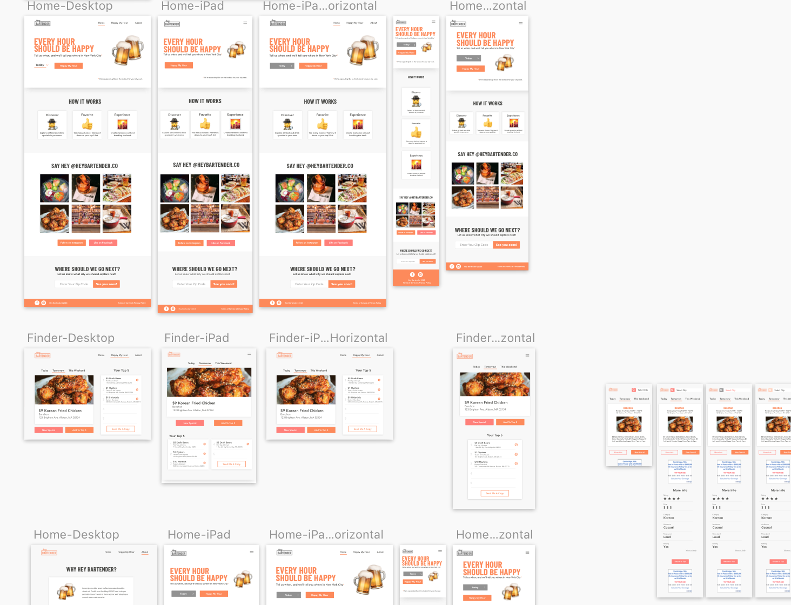

When we asked users "After you have found a special you liked on our site, what would you do next?", they responded by going to Yelp to view ratings, reviews, and to look at the restaurant's website. To improve our time on site KPI and to improve the user experience, our next feature utilized the Yelp API to show users the restaurant rating, the number of reviews on Yelp, telephone number, and a link to the website. While I initially planned to include information such as parking, dress code, and ambiance, I had to reassess and define what were the core features that users would want, due to time constraints and API data restrictions.

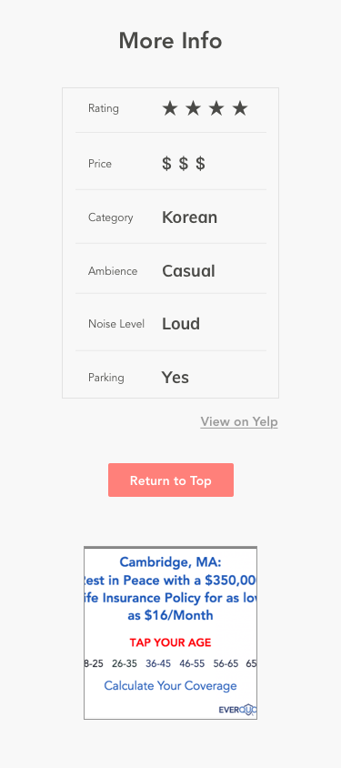

##Final Iteration
###Final KPIs
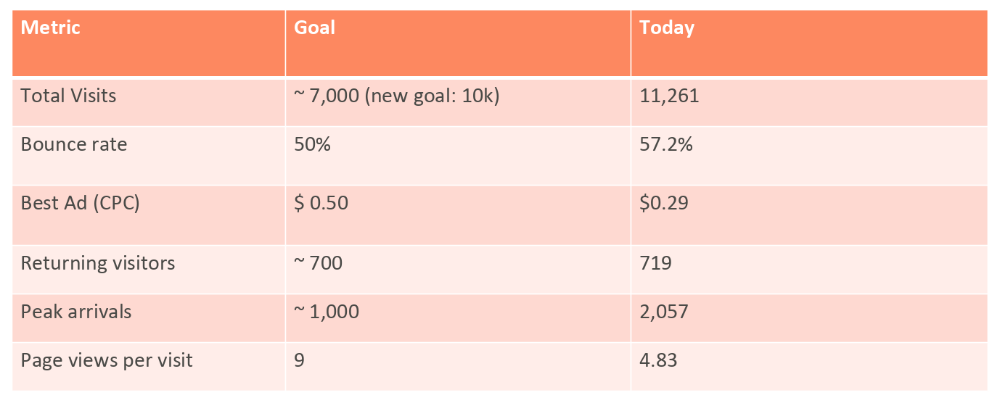
###Next Steps

At the end of the 10-week internship, Hey Bartender was in over 120 cities across the US. This project is being taken over by a team at Cogo Labs, thus changes to Hey Bartender's style and functionality may be changed. I did, however, design what I hoped Hey Bartender could one day become, an interactive map where users can explore areas near them.

##Lessons Learned
<h3 class="doubleHeader">Be Open and Eager</h3>

While the design interns were not obligated to participate in the engineering of the product, I dove headfirst into the front-end code. Having ownership of the product from start to finish, I wanted to build and deploy the best possible product, not just design it. By learning from Cogo's full-time designers and engineers, I was able to pick up new technologies such as React, styled components, and also learned how to write SQL queries. My first-hand experience with the hand-off process gave me valuable insights into how to make the transition more efficient and easier for both designers and engineers.
 

###Data and Design

A crucial lesson was how powerful data can be when applied to the design process. Including quantitative data allowed me to confirm or disconfirm my assumptions without having to spend the time to test them with users in person. After establishing a base with quantitative metrics, qualitative feedback received from user testing provided the insights to develop an even more refined and personalized experience on Hey Bartender.

###Compliance

Especially since we were working with external APIs, reaching out to users online directly, and scraping data, I was exposed to compliance in technology to ensure the data of our users were protected. By making compliance a priority from the beginning, we were able to prevent unexpected pivots during the design and development stages to correct any compliance issues.

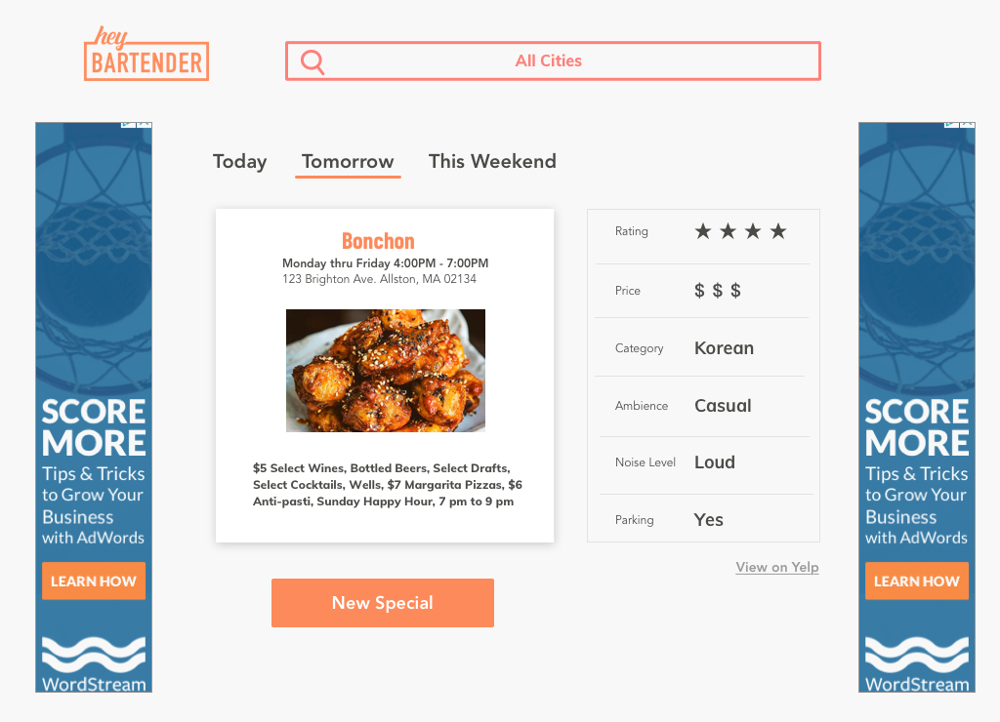