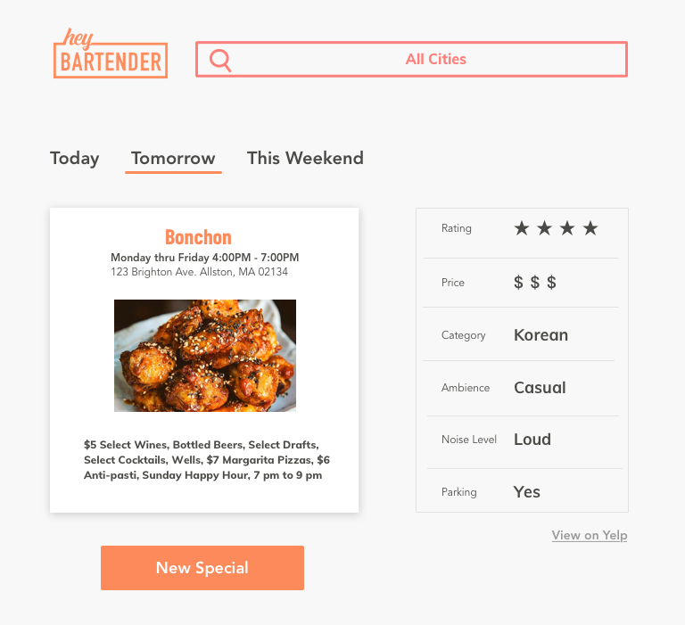

<h2 class="h2 afterImg">Project Overview</h2>

While interning at Cogo Labs, a startup incubator, I was the design lead and React engineer alongside two engineers and two analysts. We were tasked to build and grow an internet business based on the general theme of "events" and to maximize 10 Key Performance Indicators (KPIs) regarding user interaction and revenue. Utilizing an Agile (Kanban) development approach, Hey Bartender grew from an idea to a live application with over 12,000 active users across all the United States–all in 10 weeks.

###Key Performance Indicators
<ul>
    <li>Total Visits</li>
    <li>Total Organic Visits</li>
    <li>Total Time on Site</li>
    <li>Bounce Rate</li>
    <li>Page Views per Visit</li>
    <li>Returning Visitors</li>
    <li>Peak Arrivals in a Day</li>
    <li>Lowest Cost Per Click on an Ad (CPC)</li>
    <li>Profit Margin</li>
    <li>VPA (Revenue/Visits)</li>
</ul>

<h2 class="afterImg">Define</h2>
<h3 class="doubleHeader">The Prompt</h3>

Within the category of "events", we hypothesized potential high-growth sectors and tested them against the data by querying Cogo's internal databases. We discovered a large market within the category of Food and Drinks during our preliminary research. Wanting to narrow our efforts into a more niche, yet sizable, market, we drilled down the data to find two leads: happy hours and New York City.

###The Problem

What solidified our decision to enter this market was our competitors. I found the websites of our competitors, both direct and indirect, to be difficult to navigate and poorly designed. When I conducted preliminary user interviews, multiple pain points were repeatedly vocalized regarding the user experience of our competitors' products. One aspect, in particular, was the overwhelming choice paralysis users faced. After a tedious form, users are presented an endless list of restaurants and bars without any accompanying details about the specials, the price range, nor any images. They would then rely on Yelp or Google Reviews for the next step in the decision process. Overall, users were not given enough information from a single source to decide on where to go for happy hour. We knew that we could provide users a more personalized, efficient, and enjoyable way to find happy hours near them.

###The Users

While we had defined a problem we could address within a profitable market, we were unable to clearly define our target demographic through Cogo's databases. After researching into how bars and restaurants market their happy hours and to what demographic, I developed initial personas to guide our process. I then iterated on these personas after running a series of Facebook advertising campaigns and collect analytics on what demographics responded well to our targeted ads. The data sourced from Facebook allowed me to clearly define our target users and to develop guiding personas like Cara and Jonathan.

 

###Success

While we were given 10 KPIs, we prioritized certain metrics to reflect our definition of success for Hey Bartender. Based on the user's ideal experience with our website, we wanted to focus on the following KPIs:

Total Visits
Bounce Rate
Page Views per Visit
Returning Visitors
Peak Arrivals in a Day
Lowest Cost Per Click on an Ad (CPC)

By prioritizing these metrics, we were able to strategize our design, development, and marketing processes.

##Ideate
<h3 class="doubleHeader">Wireframes</h3>

Having established our technology stack, I wireframed our web application, starting with our Most Viable Product (MVP). We wanted an interactive experience that wouldn't require a complicated onboarding process, so I emulated Tinder's user experience. I wanted to show one option at a time to help users avoid choice paralysis. To meet our release deadline, we continued to simplify our product while still planning for the future. Our MVP included a random happy hour generator for the city of New York without features such as the date selector.

###Mockup and Style Guide

During the MVP hand-off process, the engineers and I had difficulty agreeing on a naming convention when referring to the front-end. To solve this issue, I led a meeting with my team to establish a common vocabulary in naming UI components on our site. By establishing a set of labels, we were able to work more efficiently and could all partake in conversations regarding our product. I also established scalable design patterns and code practices which allowed us to quickly grow our product beyond the MVP stage.

<a class="link" href="./styleguide.pdf" target="_blank" rel="noopener noreferrer">View full style guide</a>

I developed a style and branding guide to assist the engineers with the development of our site. Before the launch of our MVP, and subsequent update releases, I would conduct a front-end style pass through the website to ensure consistency across all devices. I noticed inconsistencies in color, alignment, and aspect ratios of images. I then documented these issues in the style guide with easy-to-copy CSS snippets.

##Iterate
<h3 class="doubleHeader">Ad Strategy</h3>

After our MVP went live, we launched a series of Facebook advertisements to drive traffic to our website and to gather feedback on user interaction. We were instructed to use Facebook and Instagram ads as our only source of paid traffic, with a budget of $7500 for 10 weeks. Working with the analysts, we designed various visual advertisements and A/B tests to improve our link conversions and the CPC (cost per click) of our ads. After running A/B tests, we found that the best ads featured images of women, had minimal text, and ran on Facebook only, rather than both Instagram and Facebook.

 

###User Testing

Before our next iteration, I conducted user testing with a sample of 7 users both in and out of our target demographic. Since our data reflected that most of our users were accessing Hey Bartender on a mobile device, I utilized both Android and iOS devices for testing. I compiled my findings in a user testing report which included bugs, issues with usability, content, visual mishaps, and interesting findings. My most notable takeaways included confusion around our Yelp integration, the copy content on the homepage, and the user flow.

###Next Iteration

Our next iteration was to expand to other cities across the US and to fix notable concerns that were brought to our attention during testing. This included optimizing advertisement space and enhancing the mobile experience. Simply by fixing the unnecessary scrolling for mobile users, we were able to decrease our bounce rate from 70% to 55%. As a team, we wanted to integrate Google Ads to boost our revenue. However, I was concerned with how it would impact the user experience of Hey Bartender. After researching user interaction with items in their peripheral vision, I designed the layout to accommodate the ads on both desktop and mobile without distracting users from the functionality of Hey Bartender.

When we asked users "After you found a special you liked on our site, what would you do next?", they responded by going to Yelp to view the rating, reviews, and to look at the restaurant's website. To improve our time on site KPI and to improve the user experience, our next feature utilized the Yelp API to show users the restaurant rating, the number of reviews on Yelp, telephone number, and a link to the website. While we initially designed for information such as parking, dress code, and ambiance, we had to reassess based on time constraints and API data restrictions.

##Final Iteration
###Final KPIs

###Next Steps

At the end of the 10-week internship, Hey Bartender was in over 120 cities across the US. This project is being taken over by a team at Cogo Labs, thus changes to Hey Bartender's style and functionality may be changed. I did, however, design what I hoped Hey Bartender could one day become, an interactive map where users can explore areas near them.

##Lessons Learned
<h3 class="doubleHeader">Compliance</h3>

###The Development Cycle

While the designer interns were not obligated to participate in the development of the product, I wanted to jump in the front-end and learn new technologies. By learning from Cogo's full-time designers and engineers, I was able to learn React and styled components, as well as some SQL and how API calls are made. I also had first-hand experience with the hand-off process and learned ways to make the process more efficient and easier for both designers and engineers.

###Data and Design

The most important lesson for me was how powerful data can be when applied to the design process. Including quantitative data allowed me to confirm or disconfirm my assumptions without having to spend the time to test them with users in person. After establishing a base with quantitative metrics, qualitative feedback received from user testing provided the insights to develop an even more refined and personalized experience on Hey Bartender.

###Facebook Ads

Based on Facebook's algorithm, advertisements work best with high relevance scores and long-running lifetimes. If we were to redo this project, we would focus on a few ads and run them for the duration of the 10 weeks.

###Compliance

Especially since we were working with APIs, reaching out to users online, and scraping data, I was exposed to compliance in technology to ensure the data of our users were protected. By making compliance a priority from the beginning, we were able to prevent unexpected pivots during the design and development stages.
