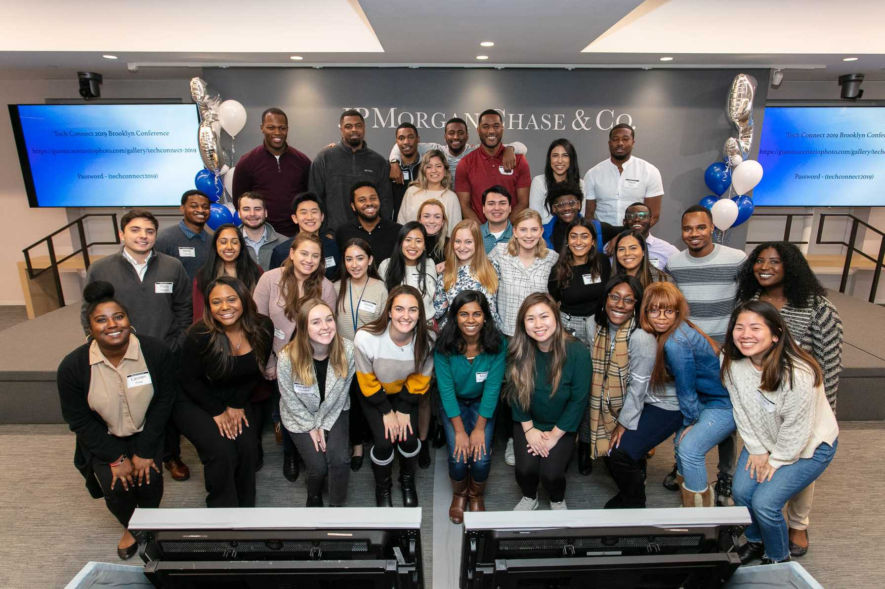

<h2 class="afterImg">Project Overview</h2>

I joined JPMorgan Chase & Co. as a full-stack software engineer within Engineering &amp; Architecture. With my specializatiion in UX/UI development and previous experience as a UX/UI designer, I took the initiative to lead the redesign of a business intelligence & analytics tool utilized by the Chief Information Officer and his leadership team. While I cannot share specifics of the product, I would be more than happy to speak about my experiences in person.

<h2>Redesigning the Product</h2>
Without a design lead on my product team, I was the only member with any experience in UX and UI design. To learn more about the design processes and tools at JPMorgan Chase, I reached out to senior designers across the firm to understand their workflows and how to make compromises between design and engineering. I then conducted user interviews with senior leaders to identify pain points, developed highly-annotated wireframes, designed mockups and data visualizations, and conducted user testing with low and high-fidelity prototypes. 

###Development Story Board

To facilitate the hand-off process with an agile approach to development, I designed a development storyboard in which I broke down my final UI design into progressive mockups that could be finished in a single sprint. This provided the engineers, including myself, a clear road-map to how the product should develop over time without sacrificing the user experience.

##Front-end Architecture
To familiarize myself with the existing code base, I self-audited the front-end code for architectural and accessibility issues. I noticed immediately that there was a lack of CSS architecture, specifically with handling colors and responsive design. While the product utilized Sass as a CSS preprocessor, Sass was not utilized to its potentential to decrease CSS bloat and to maximize modularity. I introduced a clean, reusable, and scalable CSS architecture using Sass to increase developer efficiency and to ensure a cohesive look and feel across all domains of the product.

<h2 class="afterImg">Lessons Learned</h2>
<h3 class="doubleHeader">Go to the Users</h3>
As a designer, my approach to product development is users first. I was surprised to learn that no user interviews nor user testing, neither formal nor informal, were ever conducted. The development trajectory of the product was pivoting every sprint to accomodate a change that the team assumed would be necessary. After assuming the responsibilities of redesigning the product, I immediately scheduled a user interview with one of our core users: the Chief Information Officer. It was through our interview where I learned the true pain points were for users which provided me the direction towards a product that would not only be pleasant to use, but effective, efficient, and useful to our users.

###Flexibility
While my strengths are in front-end engineering and design, in order to meet monthly deadlines, I had to be flexible with my time and my skills to fill in when needed. In a single sprint, I would be conducting a virtual user interview, wireframing a new navigation system, as well as learning how to write SQL queries and reconstructing the product's ETL process alongside an international team of engineers.

###Be Vocal
Whether it was an impediment slowing down my progress or how my team practiced Agile, I quickly learned that being vocal was more valuable than not saying anything at all. If the situation isn't condusive to productivity and meeting the goals that have been set, speak up.

##Accomplishments &amp; Involvement

<ul>
    <li>Awarded the JPMorgan Chase Five Keys Award</li>
    <li>Developed and led an accessibility workshop series for engineers as a member of the Software Engineering Program Continuous learning workstream.</li>
    <li>Recruited software engineers with a focus on diversity and inclusion</li>
    <li>Mentored collegiate students at Hackathons as a representative of JPMorgan Chase</li>
    <li>Mentor academic interns for career development</li>
    <li>Organized a week-long sustainability festival as a core member of the JPMorgan Chase Go Green team, supporting sustainable living and awareness</li>
    <li>Active site volunteer for recruiting and social engagements.</li>
    <li>Assisted in weekly yoga classes</li>
</ul>

