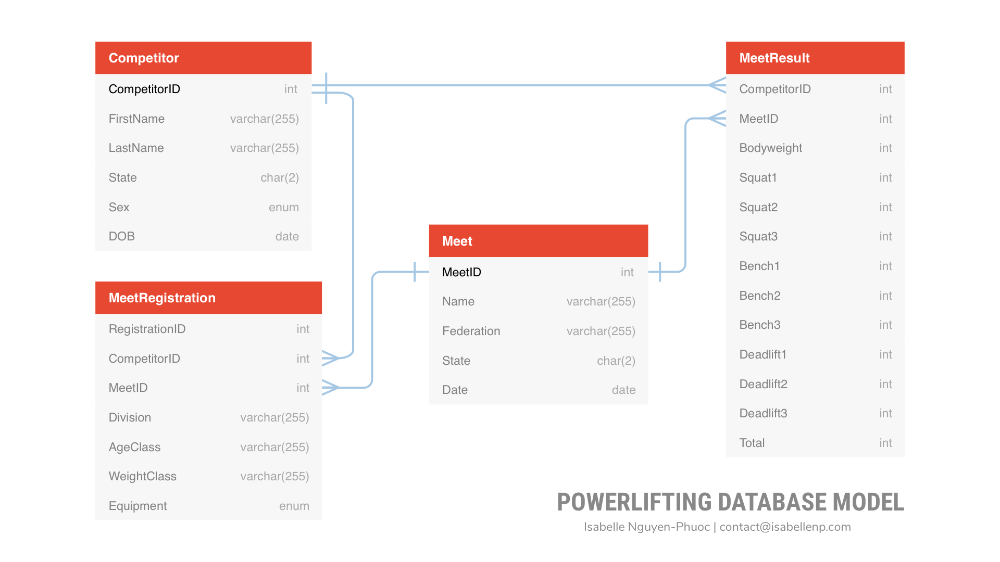

<h2 class="h2">Project Overview</h2>

One of my passions outside of technology is powerlifting. It's an individual sport where competitors have three attempts per exercise to lift as heavy as they can on the squat, bench, and deadlift. Originating from strength training traditions in ancient Greek and Persia, powerlifting competitors are judged against others of the same gender and weight class (and age division if applicable) to level the playing field.

Utilizing an open-source data set of powerlifters and their performance at federation-approved meets, I organized the data into a relational database using Microsoft SQL Server.

I organized the data into four distinct tables, Competitor, MeetRegistration, Meet, and MeetResult.

Originally, I had included weight as a field in the Competitor table; powerlifters often fluctuate in weight during the training season and cut (rapidly lose weight) before a competition. Powerlifters will also compete at different weight classes in a particular season or throughout their career, so I instead moved this information to the MeetResult table, of which one competitor can have multiple MeetResults. This allows for faster queries to calculate a powerlifter's Wilks Score, a coefficient that can be used to measure the strength of a powerlifter against other powerlifters despite the different weights of the lifters.

The MeetRegistration has a one-to-many relationship with the Competitor table to ensure that one competitor can register for multiple meets. Required fields include the competitor's division, age class, weight class, and equipment, represented by an enum of "WRAPS" or "RAW". Similarly, one Meet can have multiple MeetRegistrations and multiple MeetResults. If a competitor fails any lift, the resulting column will be 0. The MeetResult total is calculated by the heaviest, valid weight for each of the three lifts.

This project uses data from <a href="https://www.openpowerlifting.org" class="link">the OpenPowerlifting project</a>. You may download a copy of the data at <a href="https://gitlab.com/openpowerlifting/opl-data" class="link">GitLab</a>.