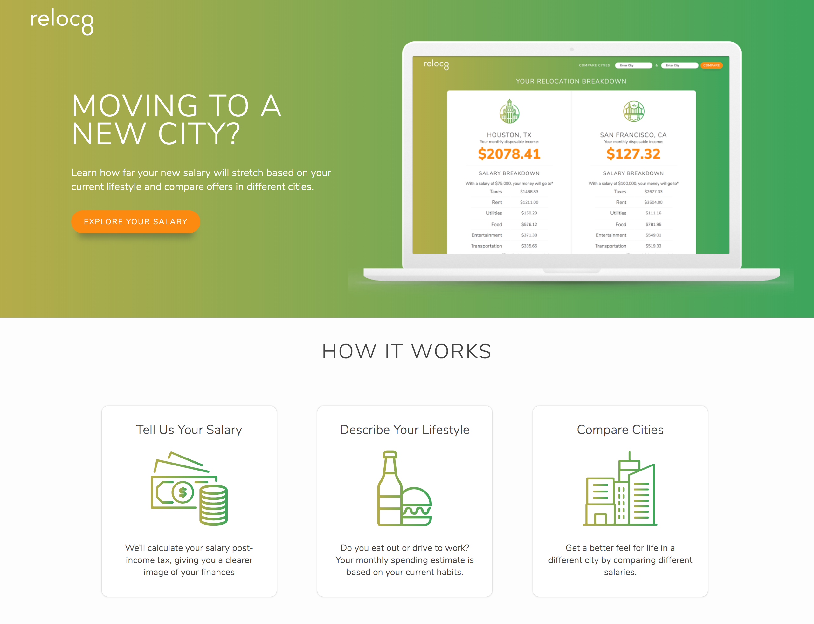

<h2 class="h2">Project Overview</h2>
Awarded Best Financial Hack from Capital One and Best Business Plan from Cornell University, Reloc8 helps users compare various salaries in different cities by calculating monthly displosable income post-tax and post-essential expenses such as rent and groceries. Reloc8's uniqueness lies in its consideration of federal and state tax, lifestyle choices, and a simple, modern user interface.

##Define
###The Problem

I competed in the Big Red Hacks hackathon hosted by Cornell University. With a focus on financial literacy and fintech, my team and I explored the problems and inconviniences in this realm that could be solved or mitigated by technology. As a then-senior in college, I reflected on my own experiences: I was about to move to a new city in a new state for my first job, unsure about what my cost of living would be like beyond broad comparisons to my current location. I hypothesized that college graduates and young professionals often move to new cities and relocate for work early on in their careers. This is also a time where they cannot be financially flexible. With so many factors to consider, young professionals cannot easily conceptualize costs of living after taking into consideration federal and state taxes as well as their lifestyle choices. Reloc8 was built to bridge this gap to ensure young professionals have a better understanding of how their expenses will pan out in a new city, allowing them to budget appropriately prior to the move itself.

###The Users

Since other hackathon participants were also college students and young professionals, I conducted multiple rounds of concept testing to ensure that our intended user base experiences these difficulties and that our approach would successfully solve these issues. My initial assumptions were confirmed and I also discovered that these young professionals spent a lot of time researching and comparing employment offers in different cities with varying salaries.

###The Solution
We iterated on my original concept to calculate and show users their monthly disposable income after taxes and other expenses in two different cities. Reloc8 takes in your income and select behavior indicators to estimate how much income you have left after essential expenses and related expenses to maintining your current lifestyle. Factors such as roommates, type of apartment or home, mode of transportation to work, and how often you eat out personalizes the algorithm to calculate an accurate estimation of your monthly disposable income. Reloc8 also provides helpful tips to make living in a city more affordable by suggesting alternatives to housing and transportation. Additionally, it is also a platform to host partners such as zillow and uhaul so users can access those services easily.

###The Business Plan
In order to make this product profitable, we decided to capitalize on the numerous costs of moving. Reloc8 would serve as a platform to host external partners and vendors by providing meaningful resouces for those who are moving. This includes negotiated packages and direct links to moving companies, truck rentals, real estate agencies, property listings, and home owner's insurance providers. At the conclusion of the hackathon, we integrated the Zillow and ... APIs to show usres rentals and homes available in both cities 

##Ideate

With only 36 hours to complete the product, I quickly wireframed the general flow of the product. I also quickly mocked-up the UI to give myself a general direction of where the product would go. Many design decisions were made on the fly as I was developing the front-end.

##Build

<h3 class="doubleHeader">Front-End</h3>

Given the working window, I decided to develop the front-end using only HTML5, CSS3, and JavaScript ES5, as I felt extremely confident that I could finish the web application within 36 hours using these technologies. Given the

###The Calculations

To calculate the costs of living, we referenced . We then pooled items that we  to form our own price baskets. We then used that coefficient with the api to calculate the expenses. We also utilized a 3rd party API, Taxee, to calculate federal and income.

###Back-end Blockers
Unfortunately, we were unable to get the back-end APIs working, so 6 hours before the deadline, I had to pivot and hard code the data into the front-end and mock the interactions with JavaScript. As the only member on my team with front-end engineering experience, I developed the entire working prototype before judging with the encouragement of my team and a lot of coffee.

##If I had more time...
###Mobile First
Given the time constraints, I focused on developing a desktop version of the product. If there had been more time, I would have started development mobile-first and then gradually responsive at the desktop level.

###Clean Code and Accessibility
Pressed for time, I had to compromise on clean code practices in order to present a working prototype to the judges. There was no architecture to the front-end code and not Section 508 nor WCAG 2.1 compliant. If given more time, I would refactor my code ensure that the HTML is semantic and accessible. In retrospect, utilizing a preprocessor such as Sass would have increased my productivity with styling, however, given that I was both the designer and the engineer, I was able to ensure a cohesive look and feel across the product.

###Modularize the Code
The front-end was also not modularized

###Add more Personalization
Our product did not have the capability to consider if users lived in one state but worked in another, therefore getting double taxed.

##Lessons Learned
<h3 class="doubleHeader">Compromise Between Perfection and Production</h3>

Especially since we were working with APIs, reaching out to users online, and scraping data, I learned a lot about compliance in regards to technology to make sure that we were within good standing. By making compliance a priority from the beginning, we were able to prevent unexpected pivots during the design and development stages.

###Agree to Disagree

As a team with strong personalities, we. To ensure that , I reached out to my other team mate to thank him for . We both agreed that we challenged each other and it helped to develop a better concept overall. Our goal was to build the best possible product at the hackathon, and we didn't put our personal feelings before that.

###Facebook Ads

Based on Facebook's algorithm, advertisements work best with high relevance scores and long-running lifetimes. If we were to redo this project, we would focus on a few ads and run them for the duration of the 10 weeks.

