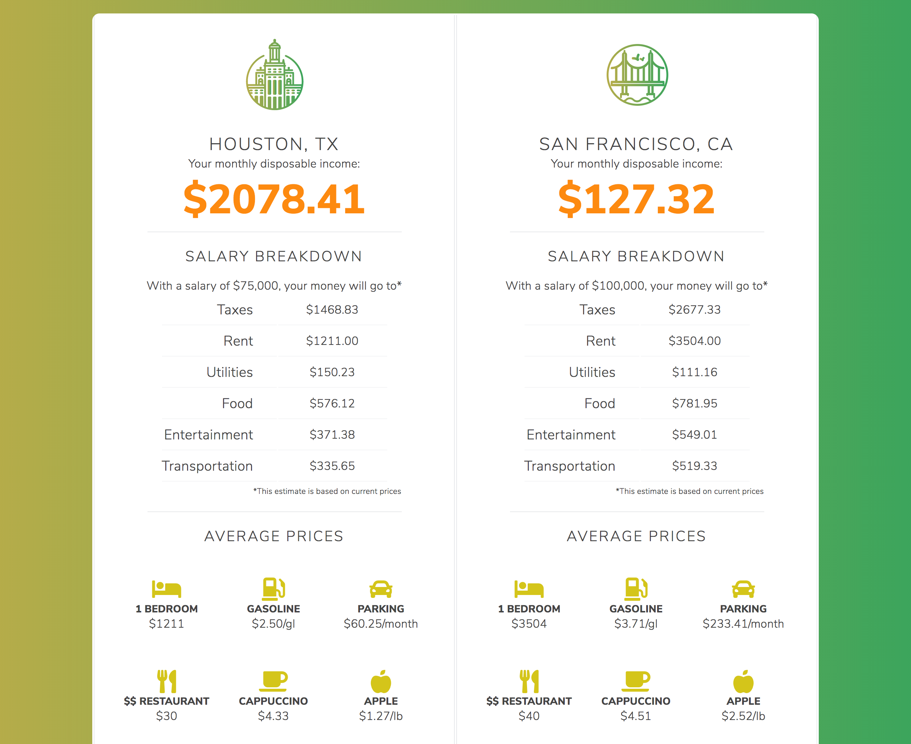

<h2 class="h2 afterImg">Project Overview</h2>

Reloc8 compares various salaries in different cities by calculating disposable income post-tax and post-essential expenses such as rent and groceries. Reloc8's uniqueness lies in its consideration of federal and state tax, lifestyle choices, and a simple, modern user interface. It was awarded Best Financial Hack from Capital One and Best Business Plan from Cornell University.

##Define
<h3 class="doubleHeader">The Problem</h3>

I competed in the Big Red Hacks hackathon hosted by Cornell University as the only student from Boston University. After finding a team to work with for the weekend, we decided to focus on the areas of financial literacy and fintech. As a then-senior in college, I reflected on my own experiences: I was about to move to a new city in a new state for my first job, unsure about what my cost of living would be like beyond broad comparisons to my current location. I hypothesized that college graduates and young professionals often move to new cities and relocate for work early on in their careers. This is also a time where they cannot be financially flexible. With so many factors to consider, young professionals cannot easily conceptualize the impact that taxes and lifestyle choices have on their financial situations.

<h3 class="afterImg">The idea</h3>

After sharing my idea, the team was hesitant as to whether or not it was innovative enough or if young adults even faced this issue. I asked my team members to continue challenging the concept to refine my reasons for choosing one idea over the other. As a team, we were still divided on two directions to take. Given the time contraints, I recommended that we break into pairs and spend 10 minutes interviewing users. Since other hackathon participants were in my target demographic, I conducted multiple rounds of concept testing where I found my initial assumptions to be confirmed. I also discovered that young professionals spend a copious amount of time researching and comparing employment offers in different cities with varying salaries. My teammate and I brought back our findings and presented the case for taking on this project based on the response from users, its feasibility, and our range of skills. We decided as a team to develop this idea further to ensure young professionals have a better understanding of how their expenses will pan out in a new city, allowing them to budget appropriately before moving.

<h3 class="afterImg">The Solution</h3>

We iterated on my original concept into a product that factors in your income and select behavior indicators to estimate how much money you have left after essential and lifestyle expenses are paid. We also took into consideration the user's current lifestyle and how much it would cost to sustain it. Factors such as roommates, type of housing, mode of transportation, and how often you eat out personalized the algorithm to calculate a realistic estimation.

<h3 class="afterImg">The Business Plan</h3>

To make this product profitable, we decided to capitalize on the numerous costs involved with moving. Reloc8 would serve as a platform to host external partners and vendors by providing meaningful resources for our users. This includes negotiated packages and direct links to moving companies, truck rentals, real estate agencies, property listings, and home owner's insurance providers. By the end of the hackathon, we integrated the Zillow and Realtor.com APIs to display rentals and homes available in both cities.

<h2 class="afterImg">Build</h2>

<h3 class="doubleHeader">Wireframes</h3>

As the only team member with UI development and design experience, I took the lead by shaping our product's front-end. With only 36 hours to complete the product, I quickly wireframed the general flow and structure of the website. Despite this general framework, many design decisions were made on the fly as I was developing the front-end. 

<h3 class="afterImg">Front-End</h3>

Despite my confidence that I could finish the application within 36 hours, I knew compromises had to be made. For example, I focused on developing a desktop version of the product, sacrificing a mobile-first approach and responsiveness. In retrospect, utilizing a preprocessor such as Sass would have increased my productivity with styling. Though, given that I was both the designer and the front-end engineer, I ensured a cohesive look and feel across the product.

<h3 class="afterImg">The Calculations</h3>

To calculate the costs of living, our algorithm was based on data from the U.S. Bureau of Labor Statistics and the Census Consumer Expenditure Surveys. We developed price baskets representative of different States and used them as a baseline for comparison, paired with the user's inputs on lifestyle. We also utilized the Taxee API to calculate how much we had to deduct due to federal and state taxes.

###Back-end Blockers

Unfortunately, we were unable to get the back-end APIs working. Six hours before the deadline, I pivoted and hard coded the data to mock the interactions with JavaScript. As the only member on my team with front-end engineering experience, I developed the entire working prototype before presenting to the judges with the encouragement of my team and a lot of coffee.

<h2 class="afterImg">Lessons Learned</h2>
<h3 class="doubleHeader">Disagree Productively</h3>

As a team with strong personalities, we disagreed at the beginning during the ideation phase. We all had different experiences and different thoughts on what would be the best idea to pursue. I soon noticed that while we were challenging each other with valid points, we weren't doing anything. Therefore, I recommend we take action and start interviewing our users. After we decided to further develop my original concept, Atthe end of the hackathon and agreed that challenging each other to think of our solutions different was productive.

<h3 class="doubleHeader">Decide and Commit</h3>

Given the time constraints, I knew I had to compromise on having a clean, efficient product. It was unrealistic to implement every best practice and to deliver a working website in time for judging. As a designer and an engineer, it's easy to get hung up on the process and following a guide step by step, but it's also important to understand external factors that can make or break your success.
 If we talk about it all day it's not gonna get don't.

