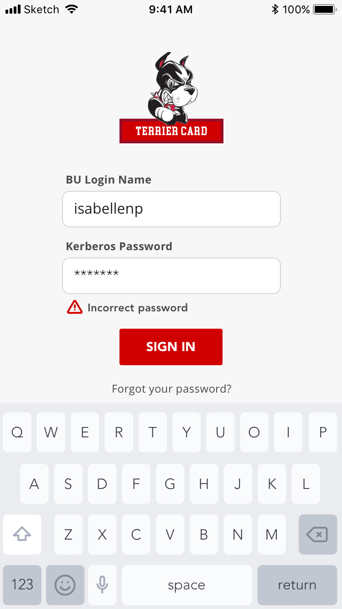
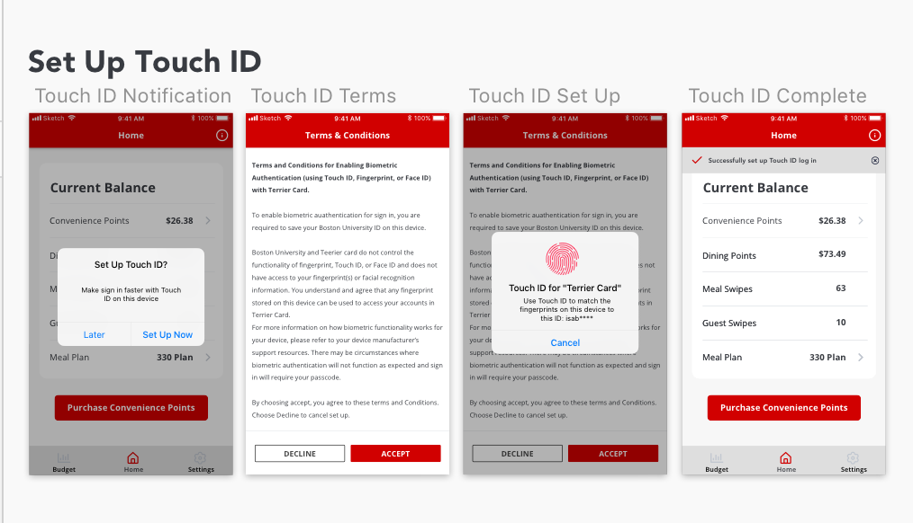
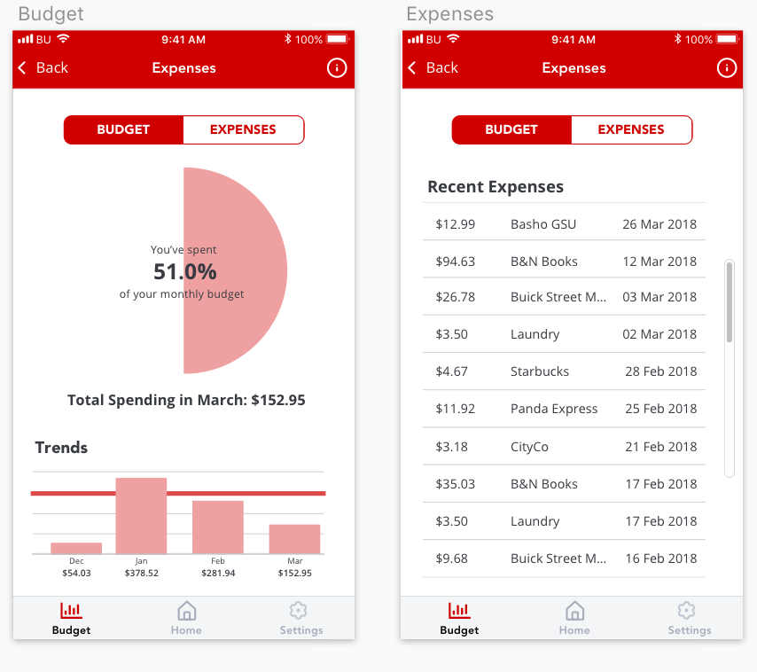
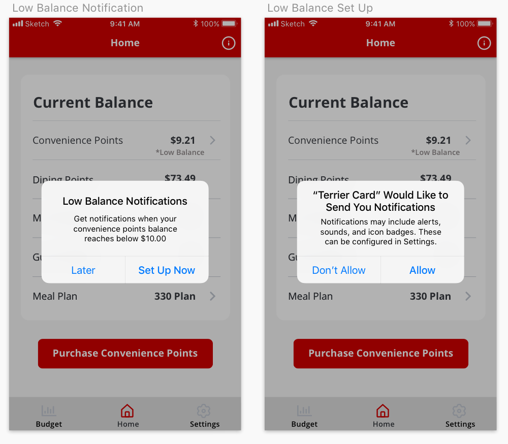
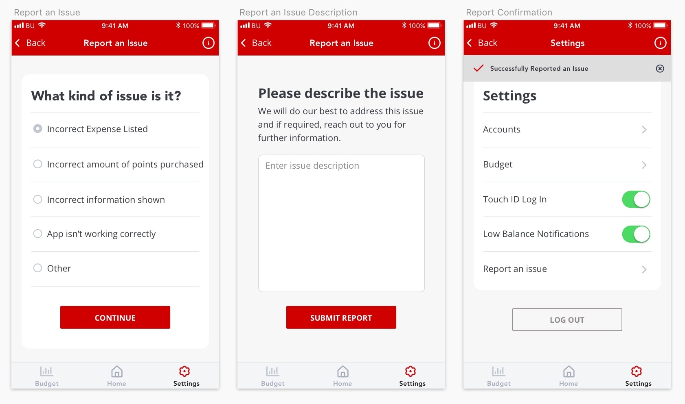

<h2 class="h2 afterImg">Project Overview</h2>

Terrier Card is a mobile application designed to meet the needs of Boston University students, to improve financial literacy in young adults, and to promote healthy relationships with money.

##Define
<h3 class="doubleHeader">The Problem</h3>

The Boston University mobile application is used daily by the majority of BU students, both undergraduate and graduate. However, many of the features are obsolete and do not satisfy the day-to-day needs of BU students. I began redesigning the entire application until I noticed there were significant pain points when using BU's payment system. There is no central location to view your balances of various currencies (dining points and convinience points) nor to add money into your account. The process is spread across multiple links on BU's student link website which is not responsive.

###The Solution

This application draws influence from mobile banking applications to provide students an efficient, clear, and easy way to manage their finances. Through interviews, I found that the majority of students purchase their points on the go using their phones, often in line while waiting to pay for their items. I focused my efforts on a clean, task-driven mobile UI that was both convinient and secure.

<h2 class="afterImg">Features</h2>

<h3 class="doubleHeader">Touch ID</h3>

While convinience was a guiding principle throughout my redesign process, I wanted to ensure the security of the app. After researching how other banking applications secured sensitive banking data and protected from malicious activity, I integrated a Touch ID set-up flow to increase security measures. This also prevents users from having to enter all of their log in details while waiting in line to pay. After Touch ID is set up, adding money to your account would require a quick thumbprint before the transaction would initiate, a simple action that can be done with one hand.

###Budgets

In my research, studies reported that only 39 percent of four-year students use budgets. I wanted users to begin developing responsible financial habits and to have a better relationship with their finances. The budgeting feature lets users set up a monthly budget for dining points and convininece points. If they spend under their budget, there is also a settting where users can carry over the remaining balance. The data on user's spending is visualized into a visual bar graph to display monthly spending at a glance, as well as reflected as a percentage of the user's monthly budget. There is also a second view where users can see exactly what they spend their points on. Financial advisors recommend tracking your spending to see where your money is really going. Utilizing this technique, the listed expenses keeps students accountable for their purchases while also seeing how much they are spending per transaction. While creating a monthly budget is not required to use the application, it is easily accessible from the menu bar in hopes that students will introduce budgeting into their daily lifestyle.

###Balance Alerts

A common scenario for students is not realizing that they are too low on points while making a purchase. As the process to add points is clunky and time consuming, a low balance alert system would notify users if their accounts fall below a specified amount.

##Lessons Learned
<h3 class="doubleHeader">Compromise Between Perfection and Production</h3>

