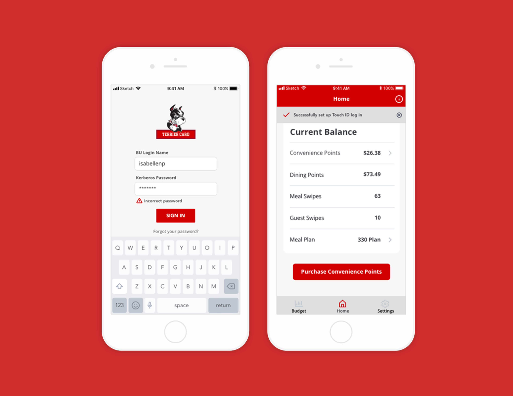
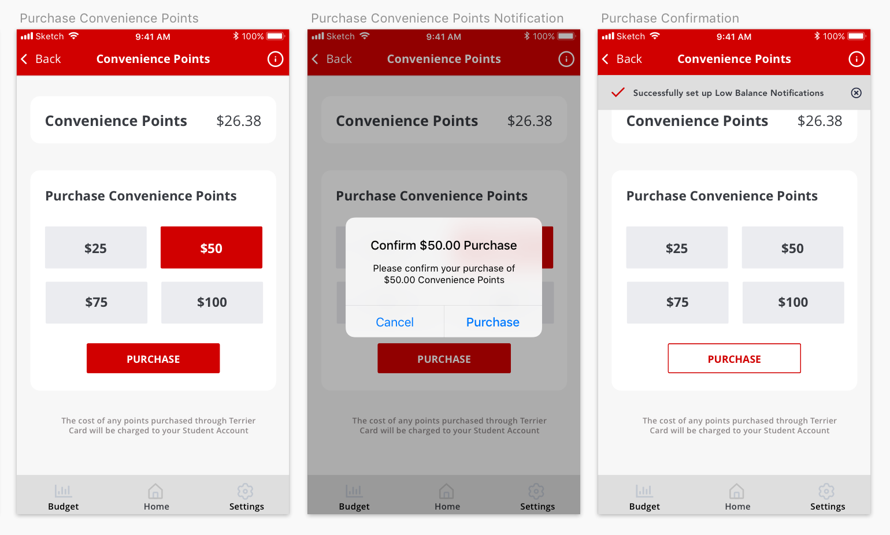

<h2 class="h2 afterImg">Project Overview</h2>

Terrier Card is a mobile application designed to meet the needs of Boston University students, to improve financial literacy in young adults, and to promote healthy relationships with money.

<h2 class="afterImg">Define</h2>
<h3 class="doubleHeader">The Problem</h3>

The Boston University mobile application is used daily by the majority of both undergraduate and graduate students. However, many of the features are obsolete and do not satisfy the day-to-day needs of the BU community. I began redesigning the entire application until I noticed there were significant pain points when using BU's payment system. There is no central location to view your balances of various currencies (dining point, convinience points, and meal swipes) nor to add money into your account. The process is spread across multiple links on BU's student link website which is not responsive.

###The Solution

This application draws influence from mobile banking apps to provide students an efficient, clear, and easy way to manage their finances while at BU. Through interviews, I found that the majority of students purchase their points on the go using their phones, often in line while waiting to pay for their items. I focused my efforts on a clean, task-driven mobile UI that was both convinient and secure.

<h2 class="afterImg">Features</h2>

<h3 class="doubleHeader">Touch ID</h3>

While convinience was a guiding principle throughout my redesign process, I wanted to ensure the security of the app. After researching how large financial institutions secure their customers' sensitive data and how they protected themselves from malicious activity, I integrated a Touch ID set-up flow. This also prevents users from having to enter all of their log in details while waiting in line to pay. After Touch ID is set up, adding money to your account would require a quick thumbprint before the transaction would initiate, a simple action that can be done with one hand.

###Budgets

In my research, studies reported that only 39 percent of four-year college students use budgets. I wanted users to begin developing responsible financial habits and to have a better relationship with their finances. The budgeting feature lets users set up a monthly budget for dining points and convininece points. If they spend under their budget, there is also a settting where users can carry over the remaining balance. The data on user's spending is visualized into a bar graph to display monthly spending at a glance, as well as reflected as a percentage of the user's monthly budget. There is also a second view where users can see exactly what they spend their points on. Financial advisors recommend tracking your spending to see where your money is really going. Utilizing this technique, the listed expenses keep students both aware of and accountable for their purchases. While creating a monthly budget is not required to use the application, it is easily accessible from the menu bar in hopes that students will introduce budgeting into their lifestyle.

###Balance Alerts

A common scenario for students is that they're making a purchase on campus, tap their Terrier Card, and suddenly realize that they are too low on points. As the process to top up their accounts is clunky and time consuming, a low balance alert system would notify users if their accounts fall below a specified amount.

###Meal Swipes

While conducting user interviews, students also expressed that they do not keep track of how many meal swipes and guest swipes they have left in the semester. To prevent students from paying $14 out of pocket for dinner, the application displays the current balance of swipes, the meal plan details, as well as a link to change your dining plan through BU directly.

<h2 class="afterImg">Lessons Learned</h2>
<h3 class="doubleHeader">Focus your efforts</h3>

By narrowing my focus to the interactions of students with their finances, I was able to dedicate all of my time and attention to building a thorough application. I challenged myself to take simple processes and make them even simplier, aesthetic, and enjoyable to use.

###Don't Reinvent The Wheel

Rather than reinventing the wheel, I looked at banking applications as inspiration for vetted design flows and features. After getting a feel for how they implemented it, I used their foundation and built upon it to personalize it for my users.

