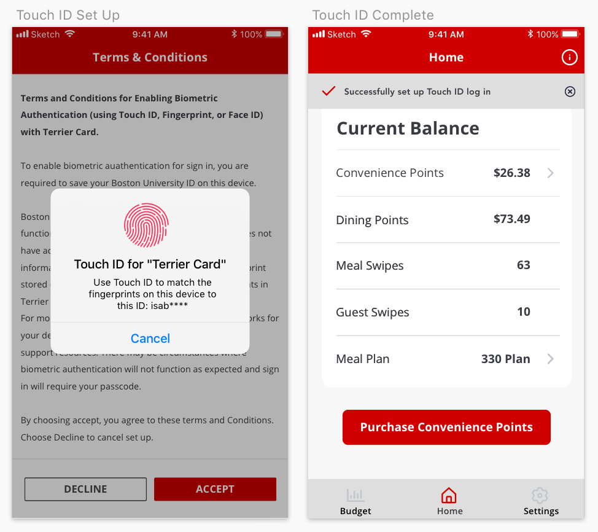

<h2 class="h2 afterImg">Project Overview</h2>

Terrier Card is a mobile application designed to improve financial habits and promote healthy relationships with money for Boston University students.

<h2 class="afterImg">Define</h2>
<h3 class="doubleHeader">The Problem</h3>

Boston University's mobile application is used daily by the majority of undergraduate and graduate students. However, many of the features are obsolete and do not satisfy the day-to-day needs of the BU community. While my original intent was to redesign the entire application from top to bottom, I soon realized that the most significant pain points of users were concentrated on BU's payment system. There is no central location to view your balances of various currencies (dining point, convenience points, and meal swipes) or to add money into your account. These cumbersome processes are spread across multiple pages on BU's student link website.

###The Solution

Terrier Card draws influence from mobile banking applications to provide students an efficient, clear, and easy way to manage their finances while at BU. Through interviews, I found that the majority of students purchase their points on their phones (e.g. in line while waiting to pay for their items). Therefore, I focused my efforts on a clean, task-driven mobile UI that was both convenient and secure.

<h2 class="afterImg">Features</h2>

<h3 class="doubleHeader">Touch ID</h3>

While convenience and simplicity were my guiding principles throughout the redesign, I wanted to ensure the security of the applications. After researching how large financial institutions secure their customers' sensitive data, I integrated Touch ID. After Touch ID is set up, adding money to a user's account would require a quick thumbprint before initiating the transaction, a simple step that can be done with one hand.

###Budgets

Studies report that only 39 percent of four-year college students use budgets. I wanted users to begin developing responsible financial habits and to have a better relationship with their finances. The budgeting feature lets users set up a monthly spending limit for dining points and convenience points. If they spend under their budget, users may opt to carry over the remaining balance for that month. The data on user's spending is visualized as both bar graphs and as a percentage of the user's monthly budget. Moreover, a second view allows users to see an itemized list of expenses. This allows students to be aware of and accountable for their purchases. While creating a monthly budget is not required to use the application, it is easily accessible from the menu bar in hopes that students will introduce budgeting into their lifestyle.

###Balance Alerts

In my experience, having an insufficient balance on your Terrier Card can be embarrassing and frustrating. With low balance notifications, users will be notified if their accounts fall below a specified amount.
 

###Meal Swipes

Students also expressed that they do not keep track of how many meal swipes and guest swipes they have left in the semester. To prevent students from paying $14 out of pocket for dinner, the application displays the current balance of swipes, the meal plan details, as well as a link to change your dining plan through BU directly.

<h2 class="afterImg">Lessons Learned</h2>
<h3 class="doubleHeader">Small Focus yet Big Impact</h3>

By identifying the most troublesome interactions for my users and focusing only on the payment processes, I challenged myself to take simple interactions and make them even simpler, more effective, and more enjoyable to use. Rather than spending time to redesign the unnecessary parts of BU's existing app, I focused on the features that would provide the most value to my users.

###Don't Reinvent The Wheel

Rather than starting from scratch, I looked at banking applications as inspiration. After vetting the design flows and features, I used their foundation and built upon it to personalize the experience for my users.

